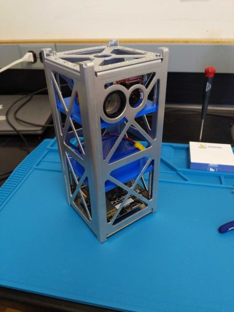

## Hola, it's me, Daniel.

I am a chemical engineer, environmental scientist, and published author, with a passion for research and writing about environmental science, technology, and data analysis. All of my degrees are in Chemical Engineering (BS/MS/PHD) and have benefited from a diverse career as a NASA scientist for seven years, as a postdoctoral fellow studying energy-society linkages, and as an Environmental Science Professor for 14 years doing scholarly work and teaching courses in energy sustainability, atmospheric science, and environmental quantitative reasoning. Recently, I decided to leave my academic institution to pursue research full time operating through my LLC Ranom Walk Research. While teaching was rewarding, my heart is in research and development and I want to spend this part of my career focusing on environmental sensor technology and data sceince. I'm particularly interested in ground and space-based sensing of the atmosphere and how it impacts weather, climate, and health. 

A project that I spent so much time and effort trying to develop over that last few years was a 2U CubeSat called Earthshine. It's mission is to photograph the moon at multiple phase angles from a Low Earth Orbit in order to estimate Earth's albedo, and by proxy climate. We only got to an early proof of concept before I left my university. Cubesats are a fascinating technology, whose utilization has a huge potential for low risk, high reward research.  

Lastly, I'm also interested in helping others design, manage, and carry out research in STEM fields that align with my expertise.

