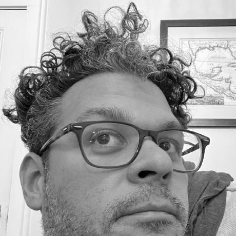

]{: .image-left } Welcome to my personal site and home of the Further Study Required Blog!

 

<h2 align="center"> Daniel Martínez's Personal Site </h2> 

<h3 align="center"> and home of the </h3>
<h2 align="center"> Further Study Required blog </h2>

  <a href="https://dmartinezphd.github.io/">home</a> | <a href="https://dmartinezphd.github.io/blog">fsr blog</a> | <a href="https://dmartinezphd.github.io/listofworks">list of works</a> | <a href="https://dmartinezphd.github.io/about">about/legal</a> 

